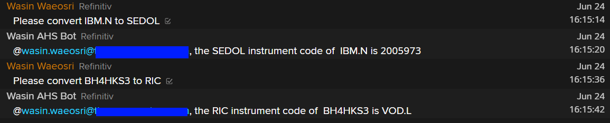
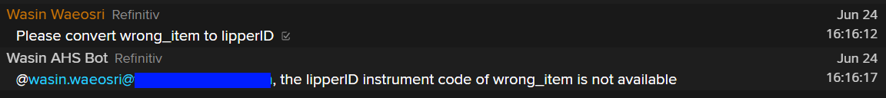

# How to Build the Symbology Conversion Chat Bot with Refinitiv Messenger Bot and Eikon Data APIs
- version: 1.0.0
- Last update: June 2020
- Environment: Windows
- Compiler: Python
- Prerequisite: [Access to Messenger application and DAPI](#prerequisite)

## <a id="overview"></a>Symbology Conversion Chat Bot Demo overview

This demo application shows how to integrates [Messenger Bot API](https://developers.refinitiv.com/messenger-api) with [Eikon Data API](https://developers.refinitiv.com/eikon-apis/eikon-data-api) to be a basic [Python](https://www.python.org/) chat bot application. The symbology chat bot receives a symbology conversion  request from users in the chatroom, then uses Eikon Data API to covert the requested symbol and lets the Bot API response to user. 

 

*Note*: The Messenger Bot API uses Refinitiv Data Platform APIs (RDP APIs) for authentication process. The APIs provide simple web based API access to a broad range of content for developers. Please refer to [RDP APIs page](https://developers.refinitiv.com/refinitiv-data-platform/refinitiv-data-platform-apis) for more detail.

## Table of contents
* [Overview](#overview)
* [Prerequisite](#prerequisite)
* [Messenger Bot API Application Workflow](#chatbot-workflow)
* [Message Rate Throttling](#message-throttle)
* [Eikon Data API integration](#dapi-integration)
* [Eikon Data API Symbology Conversion](#dapi-symbology-conversion)
* [Sending the Welcom message](#send-welcome)
* [Receive Chat Room chat Messages](#receive-messages)
* [Symbology Conversion Message Operations](#symbology-operations)
* [Running the demo application](#running-demo)
* [Conclusion](#conclusion)

## <a id="prerequisite"></a>Prerequisite 

This demo project requires the following dependencies.
1. Refinitiv Workspace with Eikon Data API access.
2. Messenger Bot API access and license.
3. [Python](https://www.python.org/) compiler and runtime.
3. Python's [Eikon Data API](https://pypi.org/project/eikon/), [requests](https://requests.readthedocs.io/en/master/), [websocket-client](https://pypi.org/project/websocket-client/) libraries. (They will be automatic installed via ```pip install -r requirements.txt``` command) .

*Note:* 
- The Python demo applications has been qualified with Python version 3.7.7.
- Please refer to the [pip installation guide page](https://pip.pypa.io/en/stable/installing/) if your environment does not have the [pip tool](https://pypi.org/project/pip/) installed. 

## <a id="chatbot-workflow"></a>Messenger Bot API Application Workflow

The Messenger Bot API application workflow combines the usage or RDP APIs with the HTTP REST API with the Bot REST and WebSocket APIs. The applciation gets access credential from the RDP Auth Service, than joins the chat room and connects to the Messgener Bot API WebSocket server. The application receives messages in the chat room via the WebSocket connection, then sends message back the chat room with the HTTP REST API. The application needs to keep renew access credential on both Authentication service and the WebSocket connection before that token is expired. Please see a full detail below:

1. Connect to Refinitiv Data Platform API (RDP API) and obtain access token, refresh token and session expiration interval for your application ID/username.
2. Get the list of chat rooms from Messenger Bot API via HTTP REST.
2. Join the selected chat room via HTTP REST API call. 
4. Connect to Messenger Bot API WebSocket server.
5. Send ```connect``` request message using RDP access token to the WebSocket server.
6. Receive chat messages from the chat room via the WebSocket event.
7. Send message back to the chat room via HTTP REST API call.
8. Re-authenticate with RDP API using a refresh token before token expiration to get a new access token.
9. Send ```authenticate``` request message using newly received RDP access token to the WebSocket server token expiration to keep session open.
10. Close the connection to finish.

### <a id="authen_process"></a>RDP Authentication Process

Refinitiv Data Platform entitlement check is based on OAuth 2.0 specification. The first step of an application work flow is to get a token, which will allow access to the protected resource, i.e. data REST API's. For the full detail and explanation of RDP Authentication process applciation workflow, please refer to the following RDP APIS tutorials:
* [Introduction to the Request-Response API](https://developers.refinitiv.com/requestresponse-apis/learning?content=38560&type=learning_material_item).
* [Authorization - All about tokens](https://developers.refinitiv.com/refinitiv-data-platform/refinitiv-data-platform-apis/learning?content=38562&type=learning_material_item).
* [Authorization in Python](https://developers.refinitiv.com/refinitiv-data-platform/refinitiv-data-platform-apis/learning?content=39322&type=learning_material_item).

The *chatbot_demo_symbology.py* application file utilizes  ```RDPTokenManagement``` class of *rdp_token.py* Python module file to manage all RDP operations and authetication process. This module source code is based on [RDP Python Quickstart Python source code](https://developers.refinitiv.com/refinitiv-data-platform/refinitiv-data-platform-apis/downloads) implemented by Gurpreet Bal with modification to support the WebSocket connection scenario.

### <a id="chatbot-workflow_2"></a>Joing the Chat Room, Send and Receive Chat Room Messages.

Once the application success authenticated with RDP Auth Service, the application can send 1-to-1 message to user in Messenger application, join a chat room, receive and post message to a joined chat room. 

Please refer to [Messenger BOT API Quick Start Guide](https://developers.refinitiv.com/messenger-api/messenger-bot-api/quick-start) and [Bot API Developer document](https://developers.refinitiv.com/messenger-api/messenger-bot-api/docs?content=81683&type=documentation_item) which provide a full detail of Messenger Bot API usages. You need to understand the HTTP request and response message, Websocket implementation for interactive Bot along with the structure of data, and limitation of the API.


## <a id="message-throttle"></a>Message Rate Throttling

Pleae note that A throttling mechanism limits messages to a maximum rate of one message per second.

An error is returned if this limit is exceeded.

## <a id="dapi-integration"></a>Eikon Data API integration

The *chatbot_demo_symbology.py* application file utilizes  ```DAPISessionManagement``` class of *dapi_session.py* Python module file to manage all Eikon Data API operations. The DAPISessionManagement class receives the Eikon Data API App Key from the application, then itimports the library and set the App Key of the application. The application is now ready to send data retrieval requests.

```
# dapi_session.py file

# Import the required libraries for Eikon and JSON operations
import eikon as ek
import logging
import json

class DAPISessionManagement:
    
    dapi_app_key = ''

    # Constructor function
    def __init__(self, app_key):
        self.dapi_app_key = app_key
        ek.set_app_key(self.dapi_app_key)

```

The DAPISessionManagement class also let the chat bot application check if it success initiaite session with Refinitiv Workspace/Eikon Desktop application or not via the ```verify_desktop_connection()``` function. This function uses Eikon Data API ```get_port_number()``` which returns the port number used to communicate with the Eikon Data API Proxy. If the connection success, it always returns a default port "9000".

```
# dapi_session.py file

class DAPISessionManagement:
    
    # ... Constructor function

    # verify if Eikon Data API is connect to Refinitiv Workspace/Eikon Desktop application
    def verify_desktop_connection(self):
        ek_port_number = ek.get_port_number()
        if int(ek_port_number) == 9000:
            return True
        else:
            return False

```

## <a id="dapi-symbology-conversion"></a>Eikon Data API Symbology Conversion

Lastly, the DAPISessionManagement class uses Eikon Data API ```get_data()``` function to get the request symbology of interested symbol. The reason that the clase choose this Eikon Data API function over ```get_symbology()``` function is the user does not require to input *an instrument code to convert from* value, users just input the symbol and *an instrument code to convert to* information to the bot. The symbology bot will do the rest for users.

```
# dapi_session.py file

class DAPISessionManagement:
    
    # ... Constructor function

    '''
    convert symbol to targe instrument code type with ek.get_data function. The supported fields are 
        - TR.RIC
        - TR.ISIN
        - TR.SEDOL
        - TR.CUSIP
        - TR.TickerSymbol
        - TR.LipperRICCode
        - TR.AssetIMO 
        - TR.OrganizationID
    '''
    def convert_symbology(self, symbol, target_symbol_type = 'TR.ISIN'):
        converted_result = True
        try:
            response = ek.get_data(symbol,target_symbol_type, raw_output = True)
            if 'error' in response or not response['data'][0][1]: # The get_data can returns both 'error' and just empty/null result 
                converted_result = False

            return converted_result, response
        except Exception as ex:
            logging.error('Data API: get_data exception failure: %s' % ex)
            return False, None

```

By default, the Eikon Data API ```get_data()``` function returns data as DataFrame object. However, since this is a console application, so the DAPISessionManagement class set ```raw_output = True``` parameter to ```get_data()``` function which makes the function returns data as JSON message instead. If the JSON response message contain *error* attribute or an empy result, it means the conversion is fail.

Now the ```DAPISessionManagement``` class of *dapi_session.py* is ready to handle all Eikon Data API operations for the main application. 

### <a id="dapi_import"></a>Import DAPISessionManagement into Chat Bot Applciation

The chatbot_demo_symbology.py application then imports DAPISessionManagement class from dapi_session.py module. The applciation also checks if the Eikon Data API success connect to Refinitiv Workspace/Eikon Desktop application by checking the ```verify_desktop_connection()``` function.

```
# chatbot_demo_symbology.py

from dapi_session import DAPISessionManagement # Module for manaing Eikon Data API session

# Input your Refinitiv Workspace/Eikon Desktop Eikon Data API App Key
data_api_appkey = '---YOUR DATA API APPKEY---'

dapi = None

# =============================== Main Process ========================================

print('Setting Eikon Data API App Key')
# Create and initiate DAPISessionManagement object
dapi = DAPISessionManagement(data_api_appkey)
if not dapi.verify_desktop_connection(): #if init session with Refinitiv Workspace/Eikon Desktop success
    print('Please start Refinitiv Workspace in your local machine')
    # Abort application
    sys.exit(1)
else:
    print('Initiate Eikon Data API success')
```

### <a id="chatbot_interaction"></a>Preparing the Chat Bot interaction

The application uses regular expression to detect symbology conversion request message from users. All reply messages use Python [String Template feature](https://docs.python.org/3.7/library/string.html#template-strings) for easy messages customizable for each scenario.

```
from string import Template
import re

# =============================== Data API and Symbology Variables ========================================

# Covertion request message Regular Expression pattern
symbology_request_pattern = r'Please convert (?P<symbol>.*) to (?P<target_symbol_type>.*)'

# Response messages templates
response_template = Template('@$sender, the $target_symbol_type instrument code of  $symbol is $converted_symbol')
response_error_template = Template('@$sender, the $target_symbol_type instrument code of $symbol is not available')
response_unsupported_type_template = Template('@$sender, unsupported <target symbol type> $target_symbol_type\n'
    'The supported <target symbol type> are: CUSIP, ISIN, SEDOL, RIC, ticker, lipperID, IMO and OAPermID\n')

response_unsupported_command = Template('@$sender, unsupport command. Please use the following command to convert instrument code\n'
    '"Please convert <symbol> to <target symbol type>"\n'
    '\n'
    'Example:\n'
    'Please convert IBM.N to ISIN')

                            
# Dictionary to map between input <target symbol type> and Refinitiv Workspace instrument type fields
symbol_dict = {'RIC':'TR.RIC','ISIN':'TR.ISIN','SEDOL':'TR.SEDOL',
    'CUSIP':'TR.CUSIP','ticker':'TR.TickerSymbol','lipperID':'TR.LipperRICCode',
    'IMO':'TR.AssetIMO','OAPermID':'TR.OrganizationID'}

# Help/Instruction Message
help_message = ('You can ask me to convert instrument code with this command\n'
    '"Please convert <symbol> to <target symbol type>"\n'
    'The supported <target symbol type> are: CUSIP, ISIN, SEDOL, RIC, ticker, lipperID, IMO and OAPermID\n'
    '\n'
    'Example:\n'
    'Please convert IBM.N to ISIN')
```

The ```symbol_dict``` dictionary will be used for mapping between readble instrument code types (```RIC```, ```ISIN```,```OAPermID```) and the Eikon Data API fields (```TR.RIC```, ```TR.ISIN```, ```TR.OrganizationID```).

## <a id="send-welcome"></a>Sending the Welcom message

Once the application success authenticates with RDP Auth Service and joins the associate chat room, the application sends a welcome message to notify user regarding how to use symbology conersion ccommand. The welcome message is following:

```
Hi, I am a chatbot symbology converter.

You can ask me to convert instrument code with this command
"Please convert <symbol> to <target symbol type>"
The supported <target symbol type> are: CUSIP, ISIN, SEDOL, RIC, ticker, lipperID, IMO and OAPermID

Example:
Please convert IBM.N to ISIN
```

The application calls ```post_message_to_chatroom()``` function which sends a message to the joined chat room via the Messenger Bot Rest API. The API information is following:
- API Endpoint URL: ```https://api.refinitiv.com/messenger/beta1/chatrooms/<chatroomId>/post``` and ```https://api.refinitiv.com/messenger/beta1/managed_chatrooms/<chatroomId>/post```
- Method: POST
- Header: 
    * Authorization = ```Authorization: "Bearer " + <access token>```

Please notice *the space* between the ```Bearer``` and ```Access Token``` values.

The application uses Python requests library to send the HTTP Post message to the Messenger Bot Rest API.

```
# Posting Messages to a Chatroom via HTTP REST
def post_message_to_chatroom(access_token,  joined_rooms, room_id=None,  text='', room_is_managed=False):
    if room_id not in joined_rooms:
        joined_rooms = join_chatroom(access_token, room_id, room_is_managed)

    if joined_rooms:
        if room_is_managed:
            url = '{}{}/managed_chatrooms/{}/post'.format(
                gw_url, bot_api_base_path, room_id)
        else:
            url = '{}{}/chatrooms/{}/post'.format(
                gw_url, bot_api_base_path, room_id)

        body = {
            'message': text
        }

        # Print for debugging purpose
        logging.info('Sent: %s' % (json.dumps(
            body, sort_keys=True, indent=2, separators=(',', ':'))))

        response = None
        try:
            # Send a HTTP request message with Python requests module
            response = requests.post(
                url=url, data=json.dumps(body), headers={'Authorization': 'Bearer {}'.format(access_token)})
        except requests.exceptions.RequestException as e:
            logging.error('Messenger BOT API: post message to exception failure: %s ' % e)

        if response.status_code == 200:  # HTTP Status 'OK'
            joined_rooms.append(room_id)
            print('Messenger BOT API: post message to chatroom success')
            # Print for debugging purpose
            logging.info('Receive: %s' % (json.dumps(
                response.json(), sort_keys=True, indent=2, separators=(',', ':'))))
        else:
            print('Messenger BOT API: post message to failure:',
                  response.status_code, response.reason)
            print('Text:', response.text)
    pass

# =============================== Main Process ========================================

# Send Greeting message
post_message_to_chatroom( access_token, joined_rooms, chatroom_id, 'Hi, I am a chatbot symbology converter.\n\n' + help_message)

```

The result is following:

 

## <a id="receive-messages"></a>Receive Chat Room chat Messages

Once the chat bot application connects to the Messager Bot API WebSocket server, all chat messages from users in the chat room will be available to the applciation via WebSocket's ```on_message``` event in JSON format. The JSON message format is following:

```
{
    "event":"chatroomPost",
    "post":{
        "chatroomId":"<chat room id>",
            "chatroomType": "chatroom",
            "sender":{
                "email":"<user email>"
            },
        "message":"<user chat message>",
        "messageId":"<message id>",
        "timestamp":"<timestamp>"
    }
}
```

The Symbology chat bot applciation then passes incoming JSON message to ```process_message()``` function to process users messsages. 

```
# =============================== WebSocket functions ========================================

def on_message(_, message):  # Called when message received, parse message into JSON for processing
    message_json = json.loads(message)
    logging.debug('Received: %s' % (json.dumps(message_json, sort_keys=True, indent=2, separators=(',', ':'))))
    process_message(message_json)


# Process incoming message from a joined Chatroom via the WebSocket connection
def process_message(message_json):  

    message_event = message_json['event']
    ...

```

## <a id="symbology-operations"></a>Symbology Conversion Message Operations

Lets focus on how the ```process_message()``` function handles symbology request message from the user. The chat bot demo needs to support various use cases such as the following:
1. User request for the help message via ```/help``` command.
2. User post a valid conversion request message. 
2. User post a valid message but wrong instument code type.
3. User post invalid message to a chat room. 

The below diagram show the symbology conversion workflow. The blue box is a bot response to a chat room.

 

### <a id="receive_help_messages"></a>Process Help Request message

If users forgot symbology conversion command, they can send ```/help``` message to the chat room to get an instruction message from the chat bot. The ```process_message()``` function just detects ```/help``` message and then sends the help message to the chat room for all users via ```post_message_to_chatroom()``` function.

```
def process_message(message_json):  # Process incoming message from a joined Chatroom via the WebSocket connection

    message_event = message_json['event']

    if message_event == 'chatroomPost':
        try:
            incoming_msg = message_json['post']['message']
            print('Receive text message: %s' % (incoming_msg))
            if incoming_msg == '/help': # if users request for help, response with a help message
                post_message_to_chatroom(access_token, joined_rooms, chatroom_id, help_message)
            else: # otherwise, check incoming message patter
                ...

        except Exception as error:
            logging.error('Post meesage to a Chatroom fail : %s' % error)
```

The result is following:

 

### <a id="receive_help_messages"></a>Handles Symbology Request Message

This part focus heavily on the Regular Expression matching result of user's post message and  ```'Please convert (?P<symbol>.*) to (?P<target_symbol_type>.*)'``` command pattern. The input symbol will be available via ```<symbol>``` group and the target instrument code will be available ```<target_symbol_type>``` group. 

The application also get the *user email* information from incoming JSON message to let the Bot respones to a correct person who post the conversion request.

```
# process_message() function

if incoming_msg == '/help': # if users request for help, response with a help message
    post_message_to_chatroom(access_token, joined_rooms, chatroom_id, help_message)
else: # otherwise, check incoming message patter
    try:
        sender = message_json['post']['sender']['email'] # Get message's sender

        match = re.match(symbology_request_pattern, incoming_msg, flags=re.IGNORECASE) # match incoming message with Regular Expression
        response_message = None
        if match: # If incoming message match r'Please convert (?P<symbol>.*) to (?P<target_symbol_type>.*)' pattern, it is a symbologyconvert request message.
            symbol = match.group('symbol') # get requested symbol
            target_symbol_type = match.group('target_symbol_type') # get target_symbol_type 
            if target_symbol_type in symbol_dict: # check if user input a supported instrument code type
                # convert symbology with Eikon Data API in DAPISessionManagement class
                result, converted_response = dapi.convert_symbology(symbol, symbol_dict[target_symbol_type])
                if result: #Convert success
                    response_message = response_template.substitute(sender = sender, 
                        converted_symbol = converted_response['data'][0][1], # Get converted symbol result
                        symbol = symbol, 
                        target_symbol_type = converted_response['headers'][0][1]['displayName']) 
                else: # convert fail or not found a match
                    response_message = response_error_template.substitute(sender = sender, target_symbol_type = target_symbol_type,  symbol = symbol)
            else: # if user request for an unsupported instrument code type
                response_message = response_unsupported_type_template.substitute(sender = sender, target_symbol_type = target_symbol_type)
                        
        else: # If user input other messages
            response_message = response_unsupported_command.substitute(sender = sender)
                    
        # Send a message (convert result, or unsupport symbol type) to the chatroom.
        post_message_to_chatroom( access_token, joined_rooms, chatroom_id, response_message)

    except AttributeError as attrib_error:
        logging.error('IOError Exception: %s' % attrib_error)

```

The applciation also needs to handle a symbology coversion success and fail case differently in order to give a proper response message to user via a chat room. The ```DAPISessionManagement.convert_symbology()``` function returns 2 values to the applciation, the conversion result (**True** or **False**) and Eikon Data API JSON response message. 

**If conversion result is True**: The example response message from the chat bot is following:

 

**If conversion result is False**: The example response message from the chat bot is following:

 

**If user request for unsupported instrument code**: The example response message from the chat bot is following:

 

**If user post other message to chat room**: The example response message from the chat bot is following:

 

## <a id="running-demo"></a>Running the demo application

Please see more detail in [README.md](./README.md) file.

## <a id="conclusion"></a>Conclusion

The [Messenger Bot API](https://developers.refinitiv.com/messenger-api) provides a set of APIs calls to build automated workflows or bots for the Messenger application. The API can integrates with other Refinitiv APIs such as Eikon Data API to extend Interactive Chat Bot capability for users in Refinitiv Workspace/Eikon Desktop application. There are many open opportunities to intergate with the chat bot to maximize the chat bot usages and provides assistant for both the business and the consumer.

For more advance chat bot interaction, please see [How to build Refinitiv Messenger Interactive ChatBot with Python Machine Learning and Messenger Bot API](https://developers.refinitiv.com/article/build-refinitiv-messenger-interactive-chat-bot-python-machine-learning-and-messenger-bot-api) article which show how to integrate Chat Bot with Machine Learning. 
