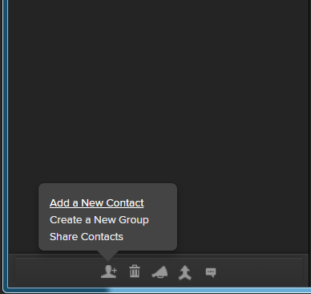
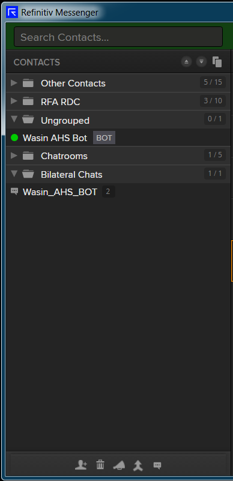

# Build Refinitiv Messenger Symbology Convertion Chat Bot with Messenger Bot and Eikon Data API
- version: 1.0.0
- Last update: June 2020
- Environment: Windows
- Compiler: Python
- Prerequisite: [Access to Messenger application and DAPI](#prerequisite)

## <a id="overview"></a>Symbology Convertion Chat Bot Demo overview

This demo application shows how to integrates [RDP](https://developers.refinitiv.com/refinitiv-data-platform/refinitiv-data-platform-apis), [Messenger Bot API](https://developers.refinitiv.com/messenger-api) and [Eikon Data API](https://developers.refinitiv.com/eikon-apis/eikon-data-api) together in a basic [Python](https://www.python.org/) application. The symbology chat bot receives a symbology convertion request from users in the chatroom, then uses Eikon Data API to covert the requested symbol and lets the Bot API response to user. 

 

The symbology chat bot aslo be albe to handle a basic interactions wiht users in the chat room.  

This demo project shows how to implement the basic Messenger BOT API console application workflows with the REST and WebSocket APIs in [Python](https://www.python.org/) programming language. The applications makes an authentication with [RDP](https://developers.refinitiv.com/refinitiv-data-platform/refinitiv-data-platform-apis) Auth service, then lets developers interact with Messeger Application/Chatroom on behalf of Bot via the REST and WebSocket APIs. 
- *chatbot_demo_symbology.py*: The symbology chat bot demo example application.
- *rdp_token.py*: A Python module that manages RDP Authentication process for chatbot_demo_symbology.py application. This module is based on [RDP Python Quickstart Python source code](https://developers.refinitiv.com/refinitiv-data-platform/refinitiv-data-platform-apis/downloads) implemented by Gurpreet Bal.

## <a id="prerequisite"></a>Prerequisite 
This demo project requires the following dependencies.
1. Refinitiv Workspace with Eikon Data API access.
2. [Python](https://www.python.org/) compiler and runtime.
3. Messenger Bot API access and license.

Please contact your Refinitiv's representative and Dino Diviacchi (dino.diviacchi@refinitiv.com) to help you to access Messenger application and Bot API. The Refinitiv team will then provision and set up the bot. Once this is done the email user you provided will receive an automated email with how to set up a password for the bot.

*Note:* 
- The Python example has been qualified with Python versions 3.6.5 and 3.7.7
- Please refer to the [pip installation guide page](https://pip.pypa.io/en/stable/installing/) if your environment does not have the [pip tool](https://pypi.org/project/pip/) installed. 

## <a id="appkey"></a>Getting the AppKey value

Once you have setup your Messenger user, please access the AppKey Generator Tool via Eikon Desktop/Refinitiv Workspace application (go to the Search Bar and type ```APP KEY```, then select the AppKey Generator) or via a <a href="https://amers1.apps.cp.thomsonreuters.com/apps/AppkeyGenerator">web site</a> (Please access with your Eikon account, *not your bot account*). 

 

You can generate your AppKey via the following steps:
1. Enter an App Display Name
2. Select the tick box next to 'EDP API' and 'Eikon Data API' as the API Type
3. Click ‘Register’ New App button

You will then see a row for your new app with an AppKey item, which is your client_id for the Refinitiv Data Platform (RDP) and Eikon Data API Authentication. 

## <a id="setting"></a>Setting the Messenger application

Once you have setup your Messenger user and Bot user, you can add the Bot and create a Chatroom for you and your Bot via the following steps

1. Login to your personal Messenger to add the bot to your contacts, using “Add a New Contact” from the menu in the lower left corner.

     

2. Add bot name **bot_agent.mybot@refinitiv.com**.

     

3. Once you have add the bot it will show up under your contacts (on the left side).

     

4. Create a chatroom using "Create a Bilateral chatroom" button from the menu in the lower left corner.

     

5. Add your Bot to a chatroom by dragging it into your newly created chatroom. 

     

## <a id="running-rest"></a>Running the REST API demo application

Please note that the Refintiv Workspace/Eikon application integrates a Data API proxy that acts as an interface between the Eikon Data API Python library and the Eikon Data Platform. For this reason, the Refinitiv Workspace/Eikon application must be running when you use the Eikon Data API Python library.

The first step is unzip or download the example project folder into a directory of your choice, then choose how to run application based on your environment below.

1. Open a command prompt or console.
2. Run ```$>pip install -r requirements.txt``` command in a console to install all the dependencies libraries.
3. Open the *chatbot_demo_symbology.py* demo application source code with your editor and input the following parameters.
    - ```app_key```: Your AppKey
    - ```bot_username```: Your Bot username
    - ```bot_password```: Your Bot password
    - ```data_api_appkey``` : Your Eikon Data AppKey 
4. Open a command prompt and go to folder *src*, then run the demo application with the following command.
    ```
    $>python chatbot_demo_symbology
    ```
5. The demo connecst to Refinitiv Workspace/Eikon desktop applciation and show the following message if it can initial session with the desktop application.
    ```
    Initiate Eikon Data API success
    ```
6. Then demo application continues authentication process, get an assoicate chatroom, then join that chatroom. The bot will send a greeting message with the symbology command instruction.
    
     
7. You can ask the chatbot to convert instrument code type for you with ```Please convert <symbol> to <target_symbol_type>``` command. The supported ```<target_symbol_type>``` are CUSIP, ISIN, SEDOL, RIC, ticker, lipperID, IMO and OAPermID
    
     
8. If you forget the command, you can send ```/help``` message in to a Chatroom to see an example.

## Next Step

This demo project demonstrates a simple chat bot interaction mechanism only. For more advance chat bot interaction, please see [How to build Refinitiv Messenger Interactive ChatBot with Python Machine Learning and Messenger Bot API](https://developers.refinitiv.com/article/build-refinitiv-messenger-interactive-chat-bot-python-machine-learning-and-messenger-bot-api) article. That article shows how to integrate Chat Bot with Machine Learning for more nature and better interaction experience. 

## <a id="author"></a>Authors
- Wasin Waeosri (wasin.waeosri@refinitiv.com)

## <a id="references"></a>References
For further details, please check out the following resources:
* [Refinitiv Messenger Bot API page](https://developers.refinitiv.com/messenger-api) on the [Refinitiv Developer Community](https://developers.refinitiv.com/) web site.
* [Refinitiv Messenger Bot API: Quick Start](https://developers.refinitiv.com/messenger-api/messenger-bot-api/quick-start). 
* [Refinitiv Eikon Data API page](https://developers.refinitiv.com/eikon-apis/eikon-data-api) on the [Refinitiv Developer Community](https://developers.refinitiv.com/) web site.
* [Eikon Data API Quick Start Guide page](https://developers.refinitiv.com/eikon-apis/eikon-data-api/quick-start).
* [Eikon Data API Tutorial page](https://developers.refinitiv.com/eikon-apis/eikon-data-api/learning).
* [Python Quants Video Tutorial Series for Eikon API](https://community.developers.refinitiv.com/questions/37865/announcement-new-python-quants-video-tutorial-seri.html).
* [Eikon Data APY Python Reference Guide](https://docs-developers.refinitiv.com/1584688434238/14684/book/en/index.html).
* [Eikon Data API Troubleshooting article](https://developers.refinitiv.com/article/eikon-data-apipython-troubleshooting-refinitiv).
* [Refinitiv Messenger Bot API: Documentation page](https://developers.refinitiv.com/messenger-api/messenger-bot-api/docs).
* [Refinitiv Messenger Bot API Demo application - JavaScript](https://github.com/Refinitiv-API-Samples/Tutorial.MessengerChatBot.JavaScript)
* [Refinitiv Data Platform APIs page](https://developers.refinitiv.com/refinitiv-data-platform/refinitiv-data-platform-apis).

For any question related to the Messenger Bot API, please use the Developers Community Q&A Forum for [Messenger Bot API](https://community.developers.refinitiv.com/spaces/303/index.html) and [Eikon Data API](https://community.developers.refinitiv.com/spaces/92/eikon-scripting-apis.html).