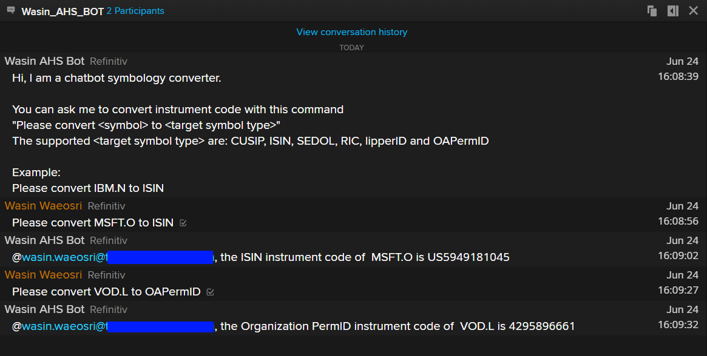
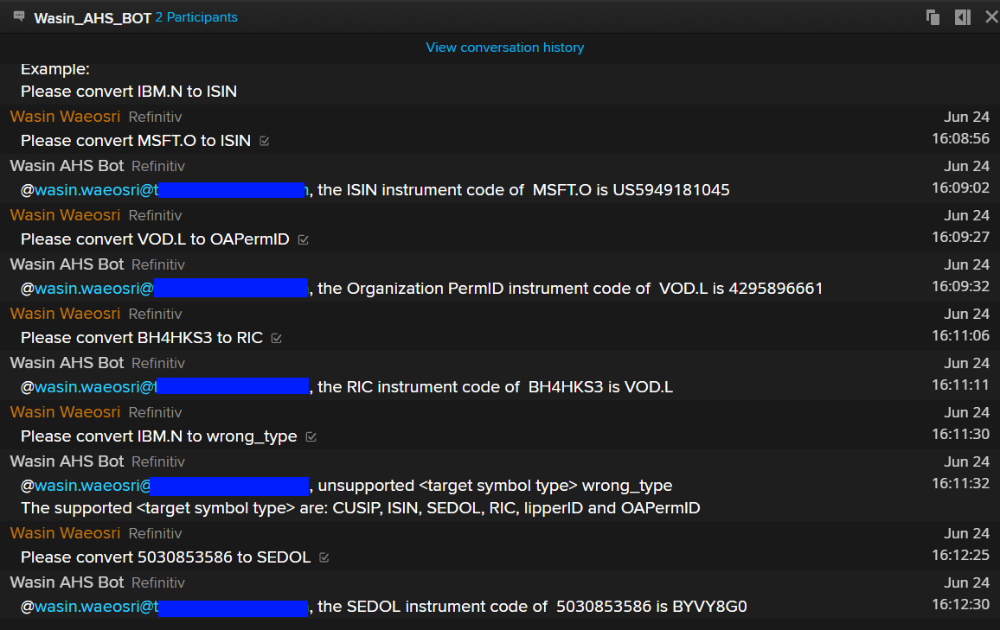

# Build the Symbology Convertion Chat Bot with Refinitiv Messenger Bot and Eikon Data APIs
- version: 1.0.0
- Last update: June 2020
- Environment: Windows
- Compiler: Python
- Prerequisite: [Access to Messenger application and DAPI](#prerequisite)

## Messenger Bot API and Eikon Data API Introduction

Refinitiv's [Messenger application](https://www.refinitiv.com/en/products/eikon-trading-software/eikon-messenger-securemessaging) is a free to use, compliant and secure messaging platform.  It is a powerful communication tool that provides desktop, mobile, and web access, and allows sharing messages, data, files, screenshots, and emoticons with your contacts. The [Messenger Bot API](https://developers.refinitiv.com/messenger-api) provides a set of available API calls to build automated workflows or bots for the Messenger application. The Bot API allows your applications to connect with and pass information into Eikon’s Messenger service programmatically or interact with a bot via a WebSocket connection.

The [Eikon Data API](https://developers.refinitiv.com/eikon-apis/eikon-data-api) (or DAPI) for Python provides simple access for users who require programmatic access to Refinitiv data on the desktop. These APIs are intended for Refinitiv Workspace/Eikon Desktop application users. The API lets users access to the following Refinitiv content sets such as Fundamental and reference data, Price time series, News, Symbology conversion and etc. It is designed for ease of use and for rapid application development by leveraging Refintiv data and entitlements to simplify market data management and reporting.

## Table of contents
* [Overview](#overview)
* [Eikon Data API Usage and Limits Guideline](#usage-limit)
* [Prerequisite](#prerequisite)
* [Getting the AppKey value](#appkey)
* [Setting the Messenger application](#setting)
* [Project Application Files](#project-files)
* [Running the demo application](#running-demo)
* [Next Step](#next-step)
* [Authors](#author)
* [References](#references)

## <a id="overview"></a>Symbology Convertion Chat Bot Demo overview

This demo application shows how to integrates [Messenger Bot API](https://developers.refinitiv.com/messenger-api) with [Eikon Data API](https://developers.refinitiv.com/eikon-apis/eikon-data-api) to be a basic [Python](https://www.python.org/) chat bot application. The symbology chat bot receives a symbology convertion request from users in the chatroom, then uses Eikon Data API to covert the requested symbol and lets the Bot API response to user. 

 

*Note*: The Messenger Bot API uses Refinitiv Data Platform APIs (RDP APIs) for authentication process. The APIs provide simple web based API access to a broad range of content for developers. Please refer to [RDP APIs page](https://developers.refinitiv.com/refinitiv-data-platform/refinitiv-data-platform-apis) for more detail.

## <a id="usage-limit"></a>Eikon Data API Usage and Limits Guideline

The Eikon Data API provides access to certain Refinitiv Workspace/Eikon data. Your access and use of Refinitiv Workspace/Eikon, including the Eikon Data API and any data included therein, is subject to the terms and conditions of your organization’s agreement with us. Refinitiv Workspace/Eikon is an information service that is licensed for individual use and requires a log in session. A log in session controls entitlements and reasonable use for a single user. In line with single user workflow demands, the Eikon Data API imposes limits to ensure that our overall platform can sustain the usage rates of all individual Eikon users accessing data via APIs. 

Please refer to [Eikon Data API Usage and Limits Guideline page](https://developers.refinitiv.com/eikon-apis/eikon-data-api/docs?content=49692&type=documentation_item) for the full detail of API usage limit and how to handle it. The examples of usage limits are shown below:
- **Requests per second**: The number of requests sent to the platform via the Eikon Data APIs cannot exceed this limit. This number of requests is counted across all client applications connected to the same Eikon instance. For example if 4 applications connected to the same Eikon send 1 request per second, the throttling mechanism will consider an aggregated rate of 4 requests per seconds.*The current limit value (10-Oct-2019) is 5 requests per second*.
- **Response volume per minute** - The volume (size) of data retrieved from the platform via the Eikon Data APIs cannot exceed this limit. This volume of data is counted across all client applications connected to the same Eikon instance. *The current limit value (10-Oct-2019) is 50 MB per minute*.
- **Requests per day** - The number of requests sent to the platform per day via the Eikon Data APIs cannot exceed this limit. This number of requests is counted across all client applications connected to the same Eikon instance.*The current limit value (10-Oct-2019) is 10,000 requests per day*.

## <a id="prerequisite"></a>Prerequisite 
This demo project requires the following dependencies.
1. Refinitiv Workspace with Eikon Data API access.
2. Messenger Bot API access and license.
3. [Python](https://www.python.org/) compiler and runtime.
3. Python's [Eikon Data API](https://pypi.org/project/eikon/), [requests](https://requests.readthedocs.io/en/master/), [websocket-client](https://pypi.org/project/websocket-client/) libraries. (They will be automatic installed via ```pip install -r requirements.txt``` command) 

Please contact your Refinitiv's representative to help you to access Messenger application, Bot API and Refinitiv Workspace with Eikon Data API access. The Refinitiv team will then provision and set up the bot. Once this is done the email user you provided will receive an automated email with how to set up a password for the bot.

*Note:* 
- The Python demo applications has been qualified with Python version 3.7.7.
- Please refer to the [pip installation guide page](https://pip.pypa.io/en/stable/installing/) if your environment does not have the [pip tool](https://pypi.org/project/pip/) installed. 

## <a id="appkey"></a>Getting the AppKey value

Once you have setup your Messenger user, please access the AppKey Generator Tool via Eikon Desktop/Refinitiv Workspace application (go to the Search Bar and type ```APP KEY```, then select the AppKey Generator) or via a [App key Generator web site](https://amers1.apps.cp.thomsonreuters.com/apps/AppkeyGenerator) (Please access with your Refinitiv Workspace/Eikon account, *not your bot account*). 

 

You can generate your AppKey via the following steps:
1. Enter an App Display Name.
2. Select the tick box next to 'EDP API' and 'Eikon Data API' as the API Types.
3. Click ‘Register’ New App button.

You will then see a row for your new app with an AppKey item, which is your client_id for the Refinitiv Data Platform (RDP) and Eikon Data API Authentication. 

*Note*: You can create different App Key (client_id) for 'EDP API' and 'Eikon Data API' by just creating two application for each API type.

## <a id="setting"></a>Setting the Messenger application

Once you have setup your Messenger user and Bot user, you can add the Bot and create a Chatroom for you and your Bot via the following steps

1. Login to your personal Messenger to add the bot to your contacts, using “Add a New Contact” from the menu in the lower left corner.

     

2. Add bot name **bot_agent.mybot@refinitiv.com**.

     

3. Once you have add the bot it will show up under your contacts (on the left side).

     

4. Create a chatroom using "Create a Bilateral chatroom" button from the menu in the lower left corner.

     

5. Add your Bot to a chatroom by dragging it into your newly created chatroom. 

     

## <a id="project-files"></a>Project Application Files
This demo project contains the following files and folders
1. *src/chatbot_demo_symbology.py*: The symbology chat bot demo example application. This code is based on [Messenger Bot API Demo chatbot_demo_ws.py source code](https://github.com/Refinitiv-API-Samples/Example.MessengerChatBot.Python).
2. *src/dapi_session.py*: A Python module that manages Eikon Data API session and operation for chatbot_demo_symbology.py application. 
3. *src/rdp_token.py*: A Python module that manages RDP Authentication process for chatbot_demo_symbology.py application. This module is based on [RDP Python Quickstart Python source code](https://developers.refinitiv.com/refinitiv-data-platform/refinitiv-data-platform-apis/downloads) implemented by Gurpreet Bal.
6. *requirements.txt*: The project dependencies configurationf file .
5. LICENSE.md: Project's license file.
9. README.md: Project's README file.

## <a id="running-demo"></a>Running the demo application

Please note that the Refintiv Workspace/Eikon application integrates a Data API proxy that acts as an interface between the Eikon Data API Python library and the Eikon Data Platform. For this reason, the Refinitiv Workspace/Eikon application must be running when you use the Eikon Data API Python library.

The first step is unzip or download the example project folder into a directory of your choice, then choose how to run application based on your environment below.

1. Open a command prompt or console.
2. Run ```$>pip install -r requirements.txt``` command in a console to install all the dependencies libraries.
3. Open the *chatbot_demo_symbology.py* demo application source code in the *src* folder with your editor and input the following parameters.
    - ```app_key```: Your AppKey
    - ```bot_username```: Your Bot username
    - ```bot_password```: Your Bot password
    - ```data_api_appkey``` : Your Eikon Data AppKey 
4. Open a command prompt and go to folder *src*, then run the demo application with the following command.
    ```
    $>python chatbot_demo_symbology
    ```
5. The demo connecst to Refinitiv Workspace/Eikon desktop applciation and show the following message if it can initial session with the desktop application.
    ```
    Initiate Eikon Data API success
    ```
6. Then demo application continues authentication process, get an assoicate chatroom, then join that chatroom. The bot will send a greeting message with the symbology command instruction.
    
     
7. You can ask the chatbot to convert instrument code type for you with ```Please convert <symbol> to <target_symbol_type>``` command. The supported ```<target_symbol_type>``` are CUSIP, ISIN, SEDOL, RIC, ticker, lipperID, IMO and OAPermID
    
     
8. If you forget the command, you can send ```/help``` message in to a Chatroom to see an example.

## <a id="next-step"></a>Next Step

This demo project demonstrates a simple chat bot interaction mechanism for a basic request-response chat message only. For more advance chat bot interaction, please see [How to build Refinitiv Messenger Interactive ChatBot with Python Machine Learning and Messenger Bot API](https://developers.refinitiv.com/article/build-refinitiv-messenger-interactive-chat-bot-python-machine-learning-and-messenger-bot-api) article. That article shows how to integrate Chat Bot with Machine Learning for more nature and better bot interaction experience. 

## <a id="author"></a>Authors
- Wasin Waeosri (wasin.waeosri@refinitiv.com)

## <a id="references"></a>References
For further details, please check out the following resources:
* [Refinitiv Messenger Bot API page](https://developers.refinitiv.com/messenger-api) on the [Refinitiv Developer Community](https://developers.refinitiv.com/) web site.
* [Refinitiv Messenger Bot API: Quick Start](https://developers.refinitiv.com/messenger-api/messenger-bot-api/quick-start). 
* [Refinitiv Messenger Bot API: Documentation page](https://developers.refinitiv.com/messenger-api/messenger-bot-api/docs).
* [Refinitiv Messenger Bot API Demo application - JavaScript](https://github.com/Refinitiv-API-Samples/Tutorial.MessengerChatBot.JavaScript).
* [Refinitiv Messenger Bot API Demo application - Python](https://github.com/Refinitiv-API-Samples/Example.MessengerChatBot.Python).
* [Refinitiv Eikon Data API page](https://developers.refinitiv.com/eikon-apis/eikon-data-api) on the [Refinitiv Developer Community](https://developers.refinitiv.com/) web site.
* [Eikon Data API Quick Start Guide page](https://developers.refinitiv.com/eikon-apis/eikon-data-api/quick-start).
* [Eikon Data API Tutorial page](https://developers.refinitiv.com/eikon-apis/eikon-data-api/learning).
* [Python Quants Video Tutorial Series for Eikon API](https://community.developers.refinitiv.com/questions/37865/announcement-new-python-quants-video-tutorial-seri.html).
* [Eikon Data APY Python Reference Guide](https://docs-developers.refinitiv.com/1584688434238/14684/book/en/index.html).
* [Eikon Data API Troubleshooting article](https://developers.refinitiv.com/article/eikon-data-apipython-troubleshooting-refinitiv).
* [Eikon Data API Usage and Limits Guideline page](https://developers.refinitiv.com/eikon-apis/eikon-data-api/docs?content=49692&type=documentation_item).
* [Refinitiv Data Platform APIs page](https://developers.refinitiv.com/refinitiv-data-platform/refinitiv-data-platform-apis).

For any question related to the Messenger Bot API, please use the Developers Community Q&A Forum for [Messenger Bot API](https://community.developers.refinitiv.com/spaces/303/index.html) and [Eikon Data API](https://community.developers.refinitiv.com/spaces/92/eikon-scripting-apis.html).